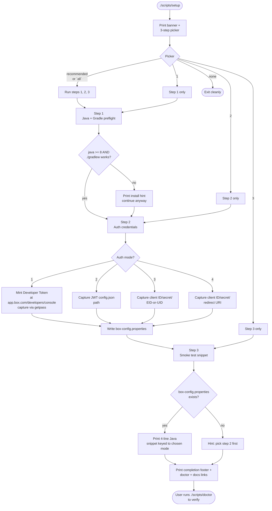

# Box Java SDK — Setup Wizard Quick Reference

A visual reference for the optional setup wizard added by the
`./scripts/setup` script. The wizard is **opt-in** — the SDK works
fine without it; this just streamlines first-time onboarding.

---

## At a glance

| Command                                | What it does                                                              |
| -------------------------------------- | ------------------------------------------------------------------------- |
| `./scripts/setup`                      | First-run + repair wizard. Picker-driven, idempotent.                     |
| `./scripts/doctor`                     | Read-only audit. Re-runs each step's check function and prints results.   |
| `./scripts/setup` then pick `recommended` | Set up Java/Gradle preflight, capture auth credentials, print a smoke snippet. |
| `WIZARD_PACE_MS=0 ./scripts/setup`     | Disable pacing for CI / scripted onboarding.                              |
| `WIZARD_PACE_MS=400 ./scripts/setup`   | Slow pacing for first-time users who want extra read time.                |

The wizard never modifies SDK source files. It writes one file at the
repo root: **`box-config.properties`** (gitignored).

---

## Decision tree



---

## Steps

| # | Step                  | Recommended | Check                                                              | Repair                                                                     | Writes                       |
| - | --------------------- | ----------- | ------------------------------------------------------------------ | -------------------------------------------------------------------------- | ---------------------------- |
| 1 | Java + Gradle preflight | yes       | `java -version` >= 8, `./gradlew --version` succeeds               | print install hint pointing at adoptium.net or `brew install gradle`       | nothing                      |
| 2 | Auth credentials      | yes         | `box-config.properties` exists with `box.auth.mode` set            | inner picker for Developer Token / JWT / CCG / OAuth, then capture creds   | `box-config.properties`      |
| 3 | Smoke test snippet    | yes         | (none — printing-only step)                                        | print a copy-pasteable Java program keyed to the chosen auth mode          | nothing                      |

---

## Picker grammar

| Input         | Means                                            |
| ------------- | ------------------------------------------------ |
| `1,2,3`       | comma-separated indices                          |
| `1-3`         | a range (inclusive)                              |
| `all`         | every step                                       |
| `recommended` | every `[R]` step (the default if you press Enter) |
| `none`        | exit without running anything                    |

---

## Auth modes

| Mode                    | When to pick                                | What the wizard collects                                  | Where it lands in `box-config.properties` |
| ----------------------- | ------------------------------------------- | --------------------------------------------------------- | ----------------------------------------- |
| Developer Token         | Local dev, testing on your own account      | One token (60-min TTL)                                    | `box.auth.token`                           |
| JWT                     | Server-to-server, no user impersonation     | Path to JWT config JSON                                   | `box.jwt.config.path`                      |
| Client Credentials (CCG) | Server-to-server, modern flow              | Client ID, secret, enterprise OR user ID                  | `box.ccg.*`                                |
| OAuth 2.0               | Multi-user, end-user-facing app             | Client ID, secret, redirect URI                           | `box.oauth.*`                              |

The wizard always sets `box.auth.mode` to one of `developer_token`,
`jwt`, `ccg`, or `oauth`. The doctor reads it to decide which
mode-specific check function should run.

---

## Cross-cutting features

### Pacing
Output is paced so multi-paragraph blocks become readable. Override
with `WIZARD_PACE_MS=<ms>` (`0` disables, `80` is default, `400` is a
slow ramp). Pacing auto-disables when stdout isn't a TTY.

### Self-contained credential capture
The wizard reads `box-config.properties` itself when needed and never
asks you to "first source X" or "first export Y". Cloning the repo and
running `./scripts/setup` is the only prerequisite.

### Doctor-symmetric checks
Every wizard step has a check function in `setup/checks.py` that the
doctor calls. Re-running `./scripts/doctor` after a wizard run prints
all results in one shot, no prompts, exit code 0 when everything's OK.

### Hidden token entry
Tokens, secrets, and client secrets are read with `getpass.getpass` so
they never echo to the terminal or land in shell history. The wizard
prints the first 8 characters back later as a sanity-check preview.

### Owner-only secrets file
`box-config.properties` is chmod 0600 on POSIX systems. Best-effort on
Windows / unusual filesystems.

---

## Common recovery paths

| Symptom                                              | What to try                                                                       |
| ---------------------------------------------------- | --------------------------------------------------------------------------------- |
| `[FAIL] java: not on PATH`                           | Install JDK 8+ from https://adoptium.net/temurin/releases/, then re-run.         |
| `[FAIL] gradle: ...`                                 | Restore `./gradlew` (`git checkout gradlew gradle/`) or `brew install gradle`.    |
| `[WARN] box-config: not found`                       | `./scripts/setup` and pick step 2.                                                |
| `[FAIL] developer-token: token empty`                | Mint a fresh one at https://app.box.com/developers/console, re-run step 2.        |
| `[FAIL] jwt-config: not at <path>`                   | Verify the path; the developer console downloads as `config.json`.               |
| Picker rejected my input                             | Use commas, ranges, `all`, `recommended`, or `none`. No spaces inside numbers.    |
| Smoke snippet 401's when I run it                    | Token expired (Developer Tokens last 60 min). Re-run step 2 for a fresh one.      |

---

## Verifying success

```bash
./scripts/doctor                                  # Should report all OK.
./gradlew test                                    # Run the SDK's own tests
```

For a real end-to-end check, paste the snippet from the wizard's step 3
into a Java file with `com.box:box-java-sdk` on the classpath, run it,
and confirm it prints your name.

---

## What this wizard does NOT do

- **Compile a smoke binary**: adding a smoke task to `build.gradle` is
  a maintainer decision, not setup-script scope. The wizard prints a
  snippet for you to integrate however you want.
- **Run the OAuth callback flow**: OAuth needs an HTTP server to
  receive the redirect, which is application-specific. The wizard
  captures credentials; running the flow is on you.
- **Refresh tokens**: Developer Tokens expire after 60 minutes. The
  doctor reminds you of that but doesn't auto-refresh.
- **Manage multiple environments**: one repo = one
  `box-config.properties`. If you need profiles, layer that on top.

---

Built using
[`setup-wizard-squared`](https://github.com/NatalieNobile/setup-wizard-squared).
See its `reference/patterns.md` for the seven design principles that
shape this wizard.
